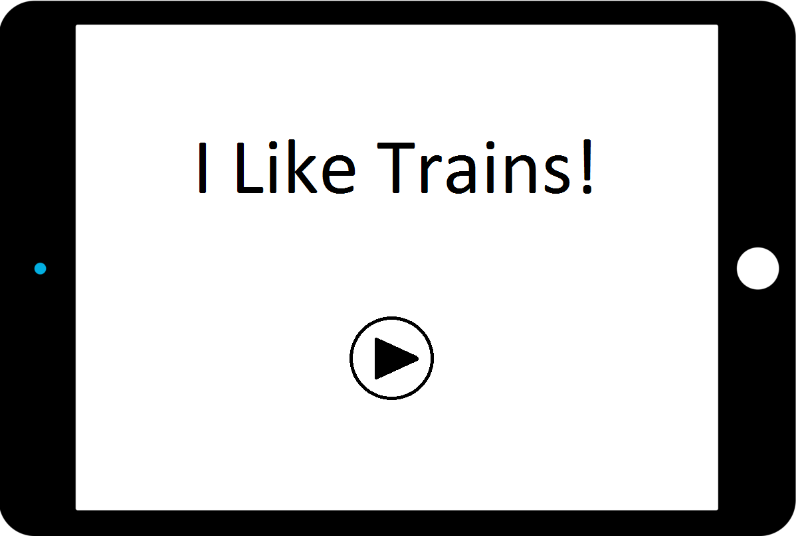

# *I Like Trains!*

**NOTE**
*I Like Trains* is still a work in progress and the description reflects the intent for the finished product.  For a
better understanding of the current status of the project read the [How Is It Made?](#how-is-it-made) and
[The Design](#the-design) sections.

## Table of Contents
1. [What is it?](#what-is-it)
2. [A User's Perspective](#a-users-perspective)
3. [Beyond Just a Game](#beyond-just-a-game)
4. [How is It Made?](#how-is-it-made)
5. [The Design](#the-design)
6. [Future Work](#future-work)

## What is it?

*I Like Trains!* is a puzzle based game for mobile devices.
The game places the user as an new employee whose job is to make trains traveling on tracks safe.  
The user is provided in each level a track and some number of trains; they then must use locks, signals, and other
tools provided to create a scenario that will allow all trains to move around their track without collisions.

## Beyond Just a Game

While my hope is that *I Like Trains* (ILT) becomes an addicting game that others will enjoy and play much to the scope they
play similar games, ILT was conceived as a more useful tool. It has become an increasingly popular view that we should make
games which are a teaching platform for something.  There are games for children which introduce them and teach them about
topics in art, mathematics, science, and much more.  ILT attempts to follow in that vein and be a tool to teach users about
parallel computing.  In particular the aim is educating users about hazards oft presented when something goes wrong, such as
deadlock and race conditions. These insidious bugs are often difficult to understand because of the difficulty for people two
follow two things happening at once. To combat this ILT aims show users a visual representation of these effects by analogizing
computer processes to a trains running on interconnected railways. The game presents users with different track layouts, number
of trains which are intended as representations of program code and execution respectively.  The user is also provided tools
such as mutex locks and condition variables to solve the puzzle. It is the goal of ILT to provide a tool which helps educate
a user in the perils as solutions to common parallel computing problems.

## A User's Perspective

A run through of a sample set of screens for *I Like Trains!* is provided below.

1. The session begins with the user opening the application and viewing a welcome screen.
  
2. Once the user presses the play button, they are presented with a level screen.
  
3. Within the level screen the user drags and drops the mutexes on to the tracks to try to prevent trains, which run clockwise on one track and counter clockwise on the other, from crashing. After creating their desired arrangement the user can test it by pressing the play button.  If the solution is correct they will move to the next level otherwise an animation of a failing scenario will be played.

## How is it made?

The project current is built in Android Studio using the LibGDX game development library. The program starts with the `Iter1ILikeTrains` class which extends the LibGDX `Game` class.  This setup allows for multiple screens in the overall application; the class delegates to those screens and otherwise simply acts to switch between them. The screens are then implemented individually for what they need. The project currently has two designs implemented: one used by the `OpeningScreen`, and one used by the `Level1Screen` and `Level2Screen`. These two designs will be discussed further in [The Design](#the-design) section. Screens however have three primary parts: the world state, rendering, input processing.  The world state keeps track of the positions and details of every object, such as the position and state of locks on the track.  Each thing that is in a level with the exception of text is handled by its own class.  The encapsulation helps keep the screen organized for the programmer.  Rendering refers to the actual drawing of elements of a screen onto the screen, or what does all this stuff in the scene look like. The final part, input processing, deals with how the application handles what a user does, i.e. what happens when a user touches a train.  The game and screens provide a base for the rest of the program.

LibGDX also provides other functionality which this project attempted to use. In particular dragging and dropping locks from the left part of the screen to onto the track was intended to be done through the LibGDX.  This process involves creating `Actors` which LibGDX provides mechanisms to drag and drop onto each other.  Using this functionality proved more difficult than advertised largely due to a lack of example and documentation. In the process of trying to use Actors the majority of the code base was re-factored numerous times going between various strategies and designs.  Ultimately, the attempt to use LibGDX for this functionality was abandoned and in its place was a manual drag and drop system. In this system the touchDown event (when the use touches the screen) gets and object to be dragged.  The touchDragged event updated the program about where the dragged object is on the screen. And finally, the touchUp event signals dropping. For this two work at every stage the position of the event is used to update the world with a single dragged item at a time.  

## The Design

The design pieces are broken into three parts.  The High Level Design which describes how screens as a whole are dealt with.  Game Objects which is how the world handles each scene object. And, Tracks which discusses the rationale behind how the tracks were put together.

### High Level Design
There are two high level designs used in the game for handling screens. The first appears in the `OpeningScreen` and creates a class for each tasks it does: world state, rendering, and input handling.  These are respectively named `OpeningScreenWorld`, `OpeningScreenRenderer`, and `OpeningScreenInputHandler`. In this design the world class holds all everything the screen knows about as a model of what is happening. For example, the world might be comprised of the planets and the sun in a solar system simulation.  The world is responsible for holding those classes and updating them when the worlds update function is called.  The Renderer class is responsible for the miscellaneous drawing tasks, such as clearing the screen before drawing, and calling the appropriate draw method for each object in the scene.  Finally the input handler class is responsible for reading a user input and finding the correct action to take because of that input.  For example, the input handler should figure out if the user clicks a button and if they are then it should tell the button that it is pressed.  In the case of the Opening Screen none of these are doing much. The alternative design has only a single class for the world.  In this design the world handles the world state, rendering, and input handling.

The second design was chosen for the Level Classes because it was less awkward to implement than the first design.  This is because each part, the world, renderer, and the input handler all have to know about all the objects in the scene in order to function.  Thus the levels conglomerate those functions into the world which already stored the screens elements. The world still delegates most of its work to the scene's objects and thus the world is not made much more complex. However that is only true for updating and rendering.  Input handling is a larger problem. A large portion of input handling follows the same line as rendering and updating where the world just loops through all of the scene objects informing them of the input event.  However, the drag and drop functionality breaks this. Resulting from manual handling of drag and drop the input handling must deal with knowing what object is being dragged and other details.  These particular details along with details in regards to other events which require unrelated scene objects to interact extensively increase the worlds complexity.  The separation of these into an input handler class to reduce complexity to one particular place that is only responsible for that is the primary goal of the first design alternative.

The first design was used in the implementation of the Opening Screen because it served as a learning and comparative example of designs for future reference.

### Game Objects

The world has to deal with a lot of different elements.  In *I Like Trains!* there are buttons, trains, tracks, and more.  If the world had to deal with each of those in a different way then it would become very complex very quickly. To alleviate this issue the concept of a game object is used. Game objects are any object which will be seen and/or manipulated by a user.  The general game object provides a consistent interface through which the world can reliably interact with any scene object without needing to know what that object particularly is. This thus simplifies the workings of world to just tell each object to draw itself, for example. Then it is only necessary that each type of game object, such as trains and tracks, follow the game object interface and do whatever is appropriate to each call.

### Tracks

Tracks are the most interesting game object in *I Like Trains*.  The tracks need to be adaptive and handle change simply. To this end tracks are comprised of track pieces which most importantly know what track piece is next.  This structure, known as a linked list, allows track pieces to be added or removed with minimal changes.  This is used in when a mutex is added along a track.  Instead of a track monitoring where a train is and where all the mutexes along the track are mutexes are just a different track piece. Therefore, when a new mutex is added to the track the linked list needs to add the new mutex track piece in the correct position, and spit the track piece the mutex is on into the part before the mutex and the part after the mutex.  By designing the track in this fashion modifying the track by any addition and subtraction is simplified.

## Future Work
**Note:**
These appear better in github where they appear as checkboxes.

The following list of Future Work appears in no particular order.
[ ] Decide on a consistent design
[ ] More Track Types
[ ] Improve the Design. Too much is rather ad hoc and needs more thought
[ ] Be able to move and remove placed mutexes
[ ] Collision detection for trains
[ ] Deadlock detection
[ ] starvation detection
[ ] Algorithm for finding bad scenarios
[ ] Investigate other frameworks
[ ] Use as a simulation tool for debugging misbehaving programs
